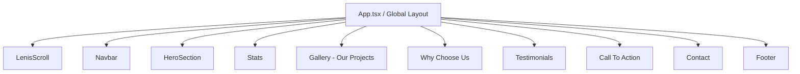

# Nexion Solutions — Design Specification

This document details the visual design, token systems, page layout, interactive states, and animations for the **Nexion Solutions** homepage.

---

## 1. Design Philosophy & Theme
Nexion Solutions is a premium tech consulting and custom software development agency. The design translates this with a **sleek dark-mode ambient aesthetic**, clean layout transitions, and high-quality graphics.

### Design Tokens

#### A. Color Palette
The colors are selected to look premium, modern, and aligned with cutting-edge tech consulting.

*   **Primary Dark (Backgrounds & Overlays)**
    *   `bg-black` (`#000000`)
    *   `bg-zinc-950` (`#09090b`)
    *   `bg-zinc-900` (`#18181b`)
*   **Secondary Neutrals (Containers, Borders & Cards)**
    *   `bg-zinc-800` (`#27272a`)
    *   `bg-zinc-100` (`#f4f4f5`) / `bg-gray-50` (`#f9fafb`)
    *   `border-zinc-200` (`#e4e4e7`)
*   **Text Hierarchy**
    *   `text-zinc-50` (Primary White, `#fafafa`)
    *   `text-zinc-900` (Primary Dark Text, `#09090b`)
    *   `text-zinc-500` / `text-zinc-600` (Secondary Muted, `#71717a` / `#52525b`)
*   **Accents**
    *   `fill-orange-400` / `text-orange-400` (Star ratings, accents)
    *   Linear transparent black-to-transparent overlays.

#### B. Typography
*   **Headings**: Clean, high-impact sans-serif (e.g., *Outfit* or *Inter*).
    *   Font weights: `font-medium` (500) and `font-semibold` (600).
    *   Line heights: `leading-tight` and `leading-none`.
*   **Body & UI Text**: *Inter* or equivalent modern system sans-serif.
    *   Font weights: `font-normal` (400) and `font-medium` (500).

---

## 2. Global Components & Layout

### 1. Lenis Scroll Smoothness
*   Provides linear smooth inertial scrolling across all browsers to enhance modern UI feelings.

### 2. Navbar Component
*   **Logo Toggle**:
    *   When transparent (`scrolled === false`), renders metallic light/silver **`logo2.png`**.
    *   When scrolled (`scrolled === true`), transforms to a floating glassmorphic white bubble with a shadow and displays dark/black **`logo1.png`**.
*   **Desktop Links**: Smooth color transitions on hover.
*   **Mobile Drawer**: Handles slide-in transitions for responsive screens.

---

## 3. Page Sections Specification

### Hero Section
*   **Background**: High-detail modern office coworking graphic with glowing blue and purple accent lights (`tech-hero-bg.png`).
*   **Overlay**: Built-in `bg-black/50` for top-tier readability of white text.
*   **Elements**:
    *   *Badge*: Renders `CodeIcon` next to the main title in a white glass pill.
    *   *Main Title*: "Transforming Ideas Into Powerful Digital Solutions" (`text-5xl md:text-[64px]`).
    *   *Buttons*:
        *   "Our Services" (Solid background with smooth hover scale/darken).
        *   "Talk to an Expert" (Outlined button with a sliding translation animation on hover).

### Stats Section
*   **Layout**: Left-heavy typography text area with right-heavy count-up grids.
*   **Features**:
    *   Interactive `CountUp` triggers when scrolled into view.
    *   Metrics: **200+ Projects Delivered**, **98% Client Satisfaction Rate**, **8+ Years of Experience**.

### Gallery (Our Projects)
*   **Layout**: Horizontal scroll track synced with vertical scroll progress (`sticky` container inside a `220vh` parent track).
*   **Visual cards**:
    *   Standardized dimension: `w-80 h-96`.
    *   Card overlays: Custom gradient (`bg-linear-to-t`) that translates up on hover to reveal categories (*SaaS · Web App*, *iOS · Android*, etc.) and project titles.

### Why Choose Us Section
*   **Interaction**: Accordion listing on the left, high-detail mockups on the right.
*   **Dynamic Backgrounds**: Selecting an accordion item swaps the right-side container's active image with a smooth fade (`duration-500`) and minor scale change.
*   **Items**:
    1.  *Custom Software Development*
    2.  *Expert Tech Consultation*
    3.  *Agile & Seamless Delivery*
    4.  *Scalable & Secure Solutions*
    5.  *24/7 Dedicated Support*

### Client Reviews (Testimonials)
*   **Structure**: Floating cards arranged in two vertical columns.
*   **Marquee Effect**:
    *   Column 1 scrolls upwards indefinitely (`animate-marquee-up`).
    *   Column 2 scrolls downwards indefinitely (`animate-marquee-down`).
    *   Equipped with top and bottom vertical fade masks (`bg-linear-to-t` / `bg-linear-to-b` from the container bg) to seamlessly blend cards out.

### Contact Section
*   **Layout**: Two-column layout with standard input styling and form validation.
*   **Inputs**: Includes a custom select dropdown containing options: *Web Development*, *Mobile App*, *Cloud Migration*, and *UI/UX Design*.
*   **Visual card**: Displaying a close-up picture of code on a screen (`contact-bg.png`) with operational hours overlay.
